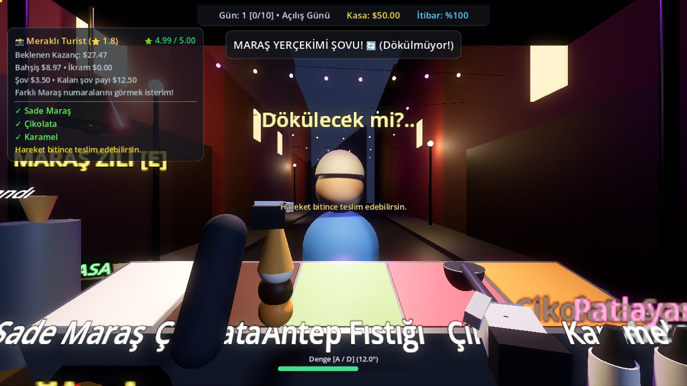
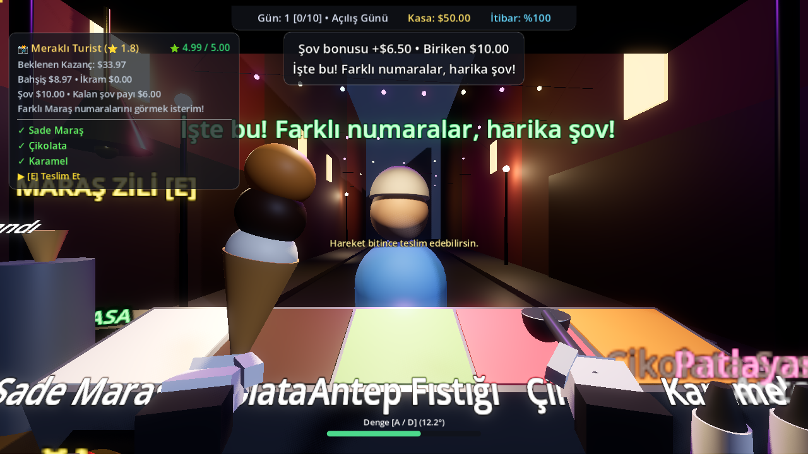
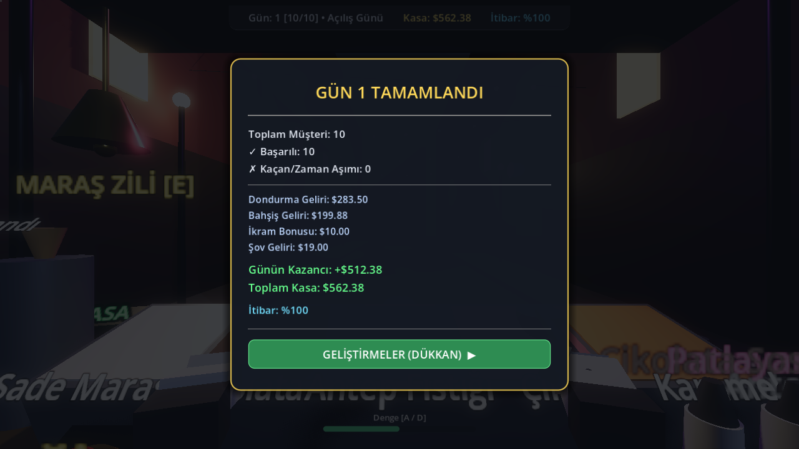

# Şov, müşteri ve kazanç sistemi

## Hesap ve ödeme

`OrderReward.calculate()` yan etkisiz tek hesap noktasıdır. `CustomerManager` hem HUD'a yayımladığı tahmini hem teslimde kullandığı dökümü buradan alır.

- Ürün bedeli: istenen top sayısı × günlük top fiyatı + istenen sos fiyatları.
- Sıcak Hava Dalgası günü top fiyatını $1 artırır ve tüm külahların güvenli denge açısını %10 azaltır.
- Bahşiş: `(puan / 5) × ürün bedeli × 0,40 × (müşteri çarpanı + bahşiş geliştirmesi)`.
- İkram: en az bir fazladan sos varsa müşterinin ikram tutarı; sos başına katlanmaz.
- Şov: bu külah üzerinde tamamlanmış hareketlerden biriken tutar.
- Bileşenler kuruşa yuvarlanır; kasa, kart ve rapor aynı tutarları kullanır.

Biriken bonus kasaya hemen eklenmez. Başarılı teslimde ödeme yapılır; ikinci teslim çağrısı tekrar ödeme yapamaz. Geçersiz tarif, eksik sos, bitmemiş hareket ve ayrılmış müşteri için ödeme yapılmaz.

## İlk denge değerleri

Bu değerler `ShowSession.PROFILES` içinde birlikte düzenlenir. Bunlar başlangıç ayarlarıdır; insan oyuncularla uzun süreli ekonomi/oynanış dengesi ölçülmüş değildir.

| Müşteri | İlk kaçırma | İlk ters çevirme | İlk kurtarma | İkinci aynı hareket | Yeni hareket çeşitlilik bonusu | Müşteri başına tavan | Toplam sabır durdurma |
|---|---:|---:|---:|---:|---:|---:|---:|
| İş insanı | $3 | $2 | $2 | %0 | $0 | $6 | 1,2 sn |
| Turist | $3,50 | $4,50 | $3 | %35 | $2 | $16 | 6 sn |
| Çocuk | $4 | $4 | $3 | %35 | $1 | $14 | 7 sn |
| Gurme | $1 | $6 | $2 | %25 | $0 | $12 | 3 sn |
| Fenomen | $4 | $5 | $3 | %25 | $4 | $22 | 6 sn |

- İş insanı ilk hareketten sonraki şovlarda bonus vermez ve puandan 0,35 düşer; puan alt sınırın altına inmez. Tavan, garanti edilen kazanç değildir.
- Çeşitlilik bonusu, müşteriye daha önce gösterilmemiş ikinci/üçüncü hareket içindir. Zil çeşitlilik sayılmaz.
- Gurme, tamamlanmış doğru tarifle ve en az 4 puanla yapılan ters çevirme için $2 kalite primi verir; tekrar katsayısı bu prime de uygulanır.
- Aynı kaçırma/ters çevirmenin üçüncüsü ve sonrası ödül vermez. Kurtarma yalnızca bir kez ödüllendirilir.
- Zilin yalnızca ilk çalışı sabır durdurma hakkı kullanır; para üretmez. Bütün eğlendirme kaynakları aynı müşteri bütçesini tüketir.
- Hareket başına en fazla `2 × tekrar katsayısı` saniye sabır durdurulur; müşteri bütçesi aşılmaz. İş insanının ceza aldığı şovlar sabrı durdurmaz.
- Külah yenilemek geçmişi, ödül tavanını veya kullanılan sabır hakkını yenilemez. Kaybedilen külahın parası silinir. Yeni müşteride yeni oturum açılır.

## Hareket yaşam döngüsü

`LeftHandController` başlayan, tamamlanan ve iptal edilen hareketleri ayrı sinyallerle bildirir. `CustomerManager` sadece bekleyen müşteriye ait başlayan hareketin tamamlanmasını kabul eder.

- Kaçırma, ters çevirme, kurtarma, külah alma/bırakma ve kepçeden aktarım sırasında el meşguldür. Teslim ve çakışan hareketler engellenir.
- Kaçırma yaklaşık 0,59 saniye; ters çevirme 0,22 saniye dönüş, 0,75 saniye tutuş ve 0,22 saniye dönüşten oluşur. Tamamlanan şovdan sonra 0,6 saniye bekleme vardır; bu sırada teslim edilebilir.
- Ters çevirme, başlangıç eğimini ve açısal hızı korur. Her karede denge kodunun animasyon dönüşünü ezmesi engellenmiştir.
- Düşme/çöpe atma/sıfırlama, devam eden animasyonu ve kepçeden uçan topu iptal eder. Eski geri çağrı yeni külaha top veya ödül ekleyemez.
- Zaman aşımında şov hemen iptal edilir. Başarısız müşteri ayrılırken kalan külah temizlenir.
- Kurtarma başladığında önceki şov kesilir; ters yöndeki denge girdisiyle tamamlanır. Başarısız kurtarmada ödül yoktur.

## Doğrulama kapsamı

`tests/show_regression.gd` deterministik olarak şunları kontrol eder:

1. Günlük fiyat, istenen sos, müşteri çarpanı, bahşiş geliştirmesi, puan ve ikram hesabı.
2. Beş müşteri türünde azalan tekrar, yüzlerce hareket altında ödül/sabır sınırı, çeşitlilik ve gurme kalite koşulları.
3. Animasyon başlangıcında ödeme olmaması, tamamlanınca tek ödül, yinelenen tamamlanma ve teslim çağrılarına direnç.
4. Çakışan hareketler, animasyon sırasında teslim, iptal/düşme/sıfırlama/zaman aşımı ve aktarımın yeni külaha taşmaması.
5. Ters külahın gerçekten ters durması; kurtarmanın denge girdisiyle gerçekleşmesi; başarısız kurtarma ve HUD temizliği.
6. Canlı müşteride zil tekrarı sonrası sabrın tekrar azalmaya başlaması.
7. Gerçek ana sahnede on siparişin teslimi, tüm kazançların kasa ve raporla eşleşmesi, mağaza kartları ve satın alma düğmesi, ikinci günün başlaması.

Sipariş hazırlama testlerde kontrollü olarak yapılır; fareyle kepçelemenin kullanılabilirliği veya uzun süreli insan oynanış dengesi bu testlerin kapsamı değildir.

Görsel doğrulama için:

```bash
env XDG_DATA_HOME=/tmp/maras-regression-data godot --path . \
  --audio-driver Dummy --resolution 1280x720 --windowed --fixed-fps 60 \
  res://tests/show_regression.tscn -- --capture=/tmp/maras-review
```

Bu komut varsayılan Forward+ görüntüleyicisiyle ters külahı, kazanç kartını ve gün sonu raporunu kaydeder. `--rendering-method gl_compatibility` eklenerek Compatibility görüntüleyicisi de kontrol edilebilir. Sabit FPS ile hızlı kapanışta Godot bazen ses kaynakları için ObjectDB uyarısı üretebilir; test betiği yine de tüm çalışma zamanı hatalarını başarısızlık sayar.

## İlgili akışta giderilen mevcut sorunlar

- Mağaza kartları geçersiz `theme_override_constants` erişimi nedeniyle oluşturulamıyordu; desteklenen tema değiştirme metodu kullanılıyor. Kapalı mağaza her para değişiminde yeniden oluşturulmuyor.
- Külahı sıfır ölçeğe küçültmek Jolt fizik uyarısı veriyordu; bırakma animasyonları küçük, sıfır olmayan ölçekle sonlanıp gizleniyor.

## Son doğrulama — 15 Eylül 2026

- Godot **4.7.2.stable**, Linux: `bash tests/run.sh` → **220 kontrol, 0 başarısızlık**. Güncel kodda çalışma zamanı hatası yok.
- **Forward+ / Vulkan**, AMD RX 5500 XT, 1280×720: görsel koşuda **210 kontrol, 0 başarısızlık**, çalışma zamanı hatası yok. Sonrasında teslim edilmiş siparişteki yönlendirmeyi temizleyen HUD değişikliği, yukarıdaki 220 kontrollü koşuda ayrıca doğrulandı.
- Compatibility / OpenGL görüntüleyicisinde de önceki görsel koşu geçti.
- `git diff --check` temiz.
- Hızlı test kapanışında ses kaynaklarıyla ilgili ObjectDB uyarısı sürüyor; sonuçlar bu uyarı gizlenmeden raporlandı.






